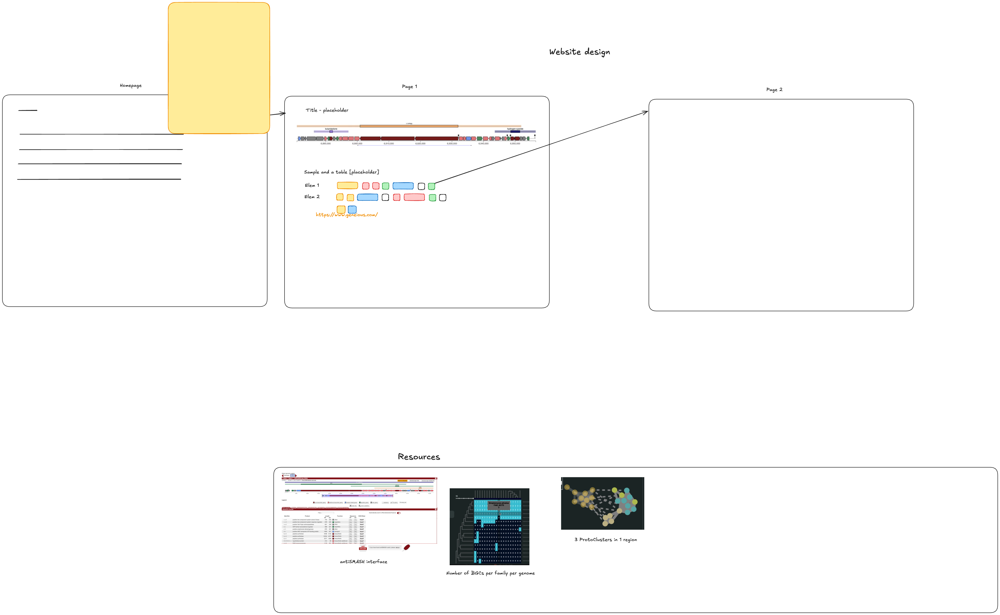

# BiG-VIEWS

Biosynthetic Genomics Visualization and Interoperability with Enhanced Workflows and Scalable software

## UI Design

### Improve the UI design

The UI design is a work in progress. It is currently implemented in Excalidraw and can be found in the `design` directory. To imrove the design, we recommend the following steps:

1. Clone the repository.
2. Open the Repository in VS Code.
3. Install the Excalidraw extension for VS Code. You can find it in the Extensions Marketplace by searching for "Excalidraw". External link [Excalidraw for VS Code](https://marketplace.visualstudio.com/items?itemName=pomdtr.excalidraw-editor).
4. Open the `UI-design.excalidraw` file in VS Code; it should launch in the Excalidraw editor automatically. The interface should resemble the screenshot below:

    

5. Make your changes to the design.
6. Save the file.
7. Commit your changes and push them to the repository.

